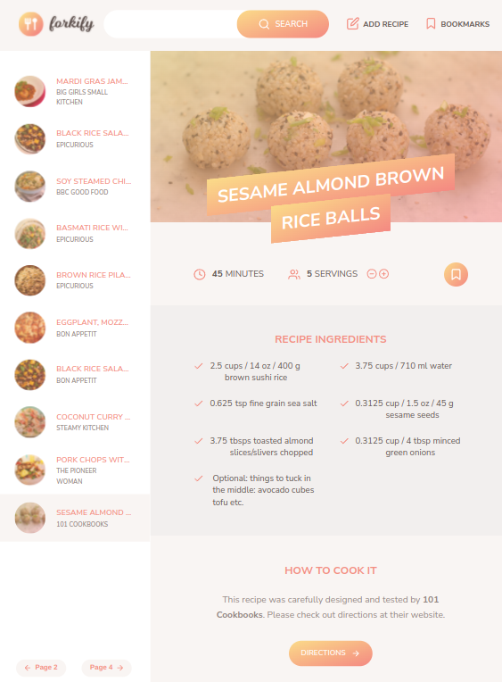

### FORKIFY

### Description :
This is the recipe-app that will help you find the recipe that you are looking for. You can select from the wide variety of recipes available with all the necessary details. You can bookmark your favourite recipes. Add your own recipes to the collection. Customise the recipes according to number of servings.

### Link to project: https://forkify-beta.netlify.app/

### How It's Made:
Tech used: HTML,Vanilla JS, CSS.

The frontend uses Html, css and vanilla JS to build the attractive UI. MVC architecture has been used where the data flow has been seperated into Model, View and Controller. The data for the app comes from an API.

### Optimizations
There could be features to make user accounts and share recipes.

### Lessons Learned:
This was a really good experience to learn MVC architecture implemented in Vanilla JS.